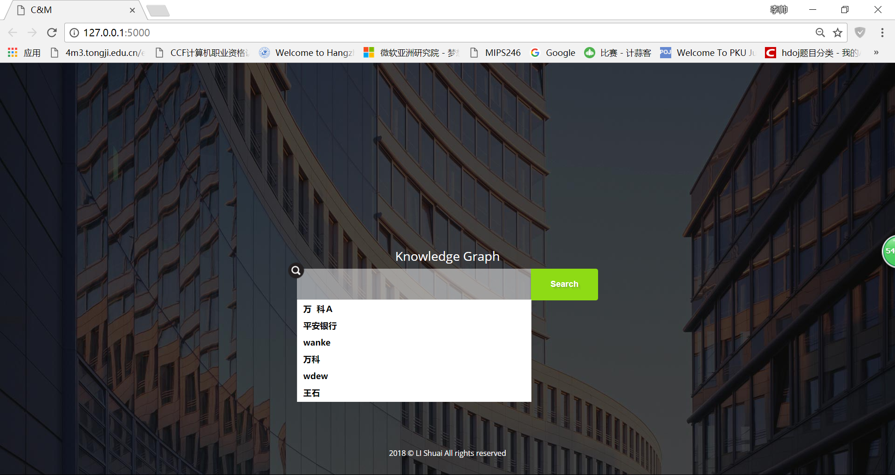
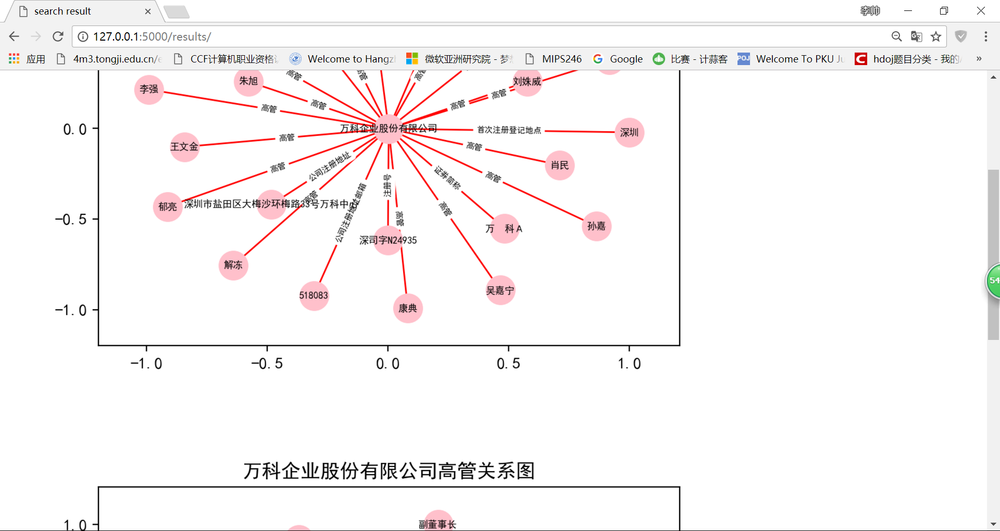

**database system project**
In this project,I'd like to implement a website based on Django.
And this is the beginning of the the hostage to fortune.:smile:

**second version**
In this version,the design has been implemented on **kownledge graph**
The project is a web based on flask,and the search engine was rewritten in python,
what'more,mongoDB provides distributed storage and networkx creates complex network graphs for your search

